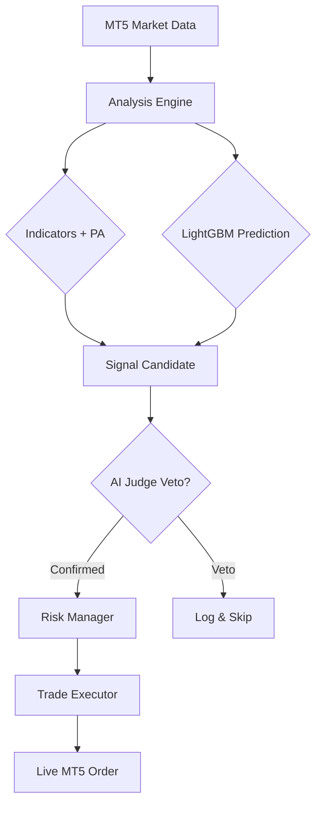

# 🤖 ApexScalp AI v4.0

**ApexScalp AI** is a state-of-the-art, multi-symbol scalping bot engineered for MetaTrader 5. It leverages the power of Machine Learning (LightGBM) and Large Language Models (Gemini/Groq) to deliver institutional-grade execution with a 3-layer confirmation logic.

---

## ⚡ Core Pillars

### 🧠 Triple-Confirm Logic
Every trade must pass through a rigorous 3-layer filter:
1.  **Technical Shell**: RSI, MACD, and EMA Trend alignment + ADX Momentum Gate.
2.  **Machine Learning**: LightGBM model trained on hundreds of thousands of data points across 10+ Forex symbols.
3.  **AI Judge**: Real-time signal validation using **Gemini-2.0-Flash** or **Groq (Llama-3.3)**.

### 🛡️ Institutional Risk Management
- **Circuit Breaker**: Stops all trading if daily drawdown exceeds 3%.
- **Adaptive SL/TP**: Dynamically adjusts Stop Loss and Take Profit based on ATR and Market Regime (Trending/Ranging/Volatile).
- **Fractional Kelly Sizing**: Optimizes position sizes based on historical win rates and profit factors.
- **Partial Close**: Automatically secures 50% profit at 1R and moves SL to breakeven.

### 🚀 Performance Engineering
- **Parallel Fetching**: Uses 8-thread concurrent processes to scan symbols 8x faster.
- **Regime Detector**: Automatically identifies market phases to stay out of choppy, low-probability environments.
- **Spread Monitor**: Skips trades if liquidity is thin or spreads are abnormally wide.

---

## 🛠️ Architecture

## 🔒 License & Security
> [!CAUTION]
> **PROPRIETARY SOFTWARE — ALL RIGHTS RESERVED**
> This code is private property. Unauthorized copying, modification, or redistribution is strictly prohibited. See the [LICENSE](LICENSE) file for full legal terms.

---
**Disclaimer**: *Trading forex and CFDs involves significant risk. This software is provided for educational purposes only. Past performance does not guarantee future results.*
